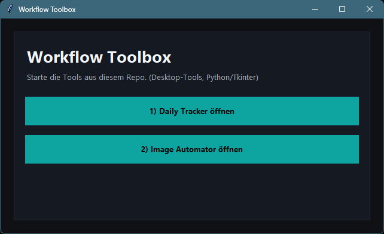
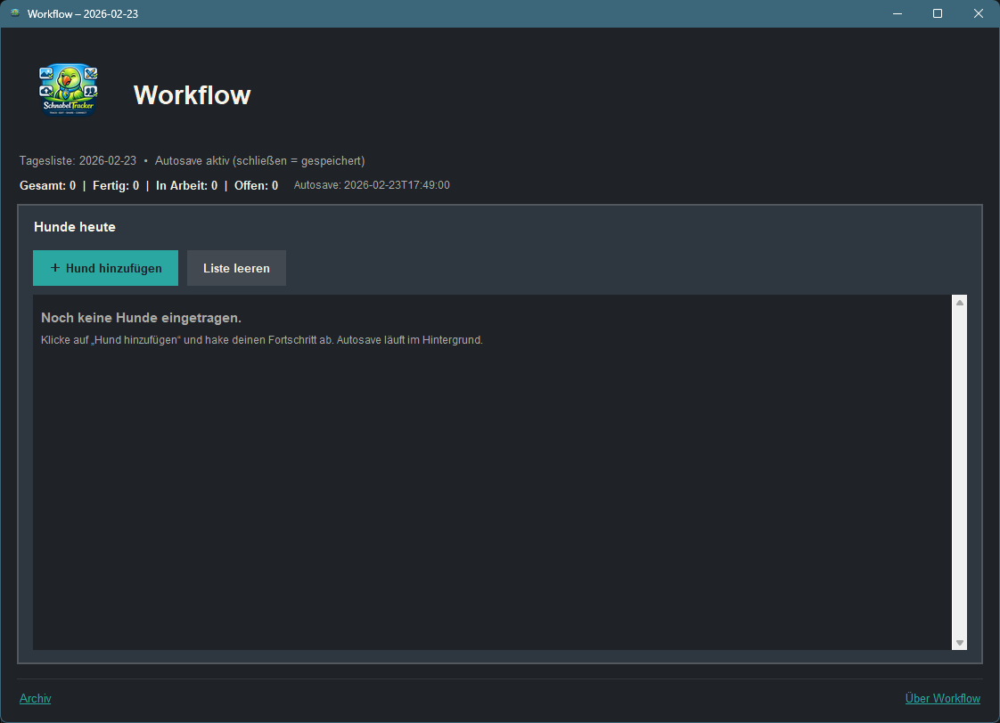
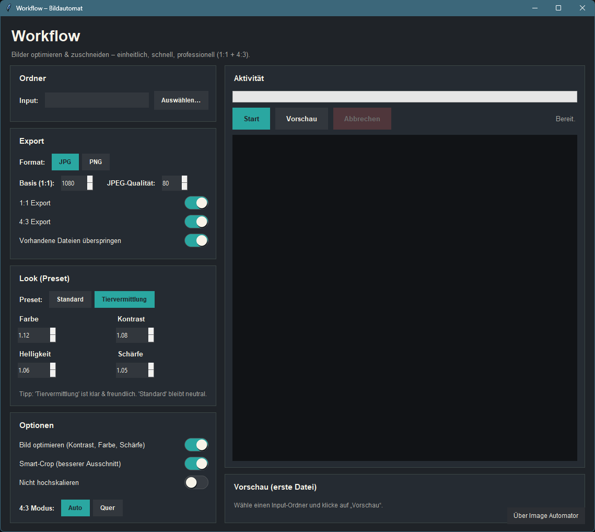

# Workflow Toolbox

Ein kleines Portfolio-Repository mit **2 Desktop-Tools** (Python/Tkinter) + einem Launcher.

## Inhalte

### 1) Daily Tracker
Pfad: `tools/daily_tracker.py`  
Ein minimalistischer Tages-Tracker (GUI) für tägliche Notizen/Status/Progress.

Start:
```bash
py tools/daily_tracker.py
```

### 2) Image Automator
Pfad: `tools/image_automator.py`  
Ein GUI-Tool für wiederholbare Bild-Aufgaben (z. B. Zuschnitt/Export in feste Formate).

Start:
```bash
py tools/image_automator.py
```

### Launcher (empfohlen)
Pfad: `toolbox_launcher.py`  
Startet beide Tools per Klick.

```bash
py toolbox_launcher.py
```

## Installation

Voraussetzungen:
- Python 3.x (Windows: empfohlen über `py`)
- Pillow

```bash
py -m pip install -r requirements.txt
```


```md
### Launcher


### Daily Tracker


### Image Automator


## Lizenz
MIT (optional)
